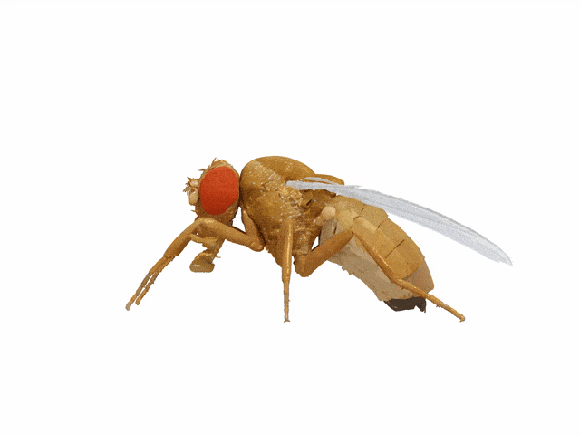

# NeuroMechFly

[](https://opensource.org/licenses/Apache-2.0)

<p align="center">
  
</p>

**NeuroMechFly** is a data-driven computational simulation of adult *Drosophila melanogaster* for neuromechanical behavioral control research. It synthesizes experimental datasets (joint tracking, pose estimation) and tests theories of neuromechanical control using PyBullet physics.

> **CHIMERA** – Modified derivative of [NeuroMechFly](https://github.com/NeLy-EPFL/NeuroMechFly) (Apache 2.0).  
> For the original publication and citation, see [Lobato-Rios et al, Nature Methods, 2022](https://www.nature.com/articles/s41592-022-01466-7).

---

## Table of Contents

- [Installation](#installation)
- [Quick Start](#quick-start)
- [Testing](#testing)
- [Project Structure](#project-structure)
- [Scripts Reference](#scripts-reference)
- [Modules Overview](#modules-overview)
- [Data Layout](#data-layout)
- [Tutorials](#tutorials)
- [License](#license)

---

## Installation

See [docs/installation.md](docs/installation.md) for full instructions.

**Quick install** (Python 3.8 recommended):

```bash
conda create -n neuromechfly python=3.8 numpy Cython shapely
conda activate neuromechfly
pip install git+https://gitlab.com/FARMSIM/farms_container.git
# On macOS: install PyBullet from conda (binary) before pip install to avoid build failures
conda install -c conda-forge -y pybullet
conda install -y pytables matplotlib networkx scipy pillow pyyaml trimesh
pip install treelib jmetalpy scikit-posthocs df3dpostprocessing==1.1.0
pip install -e farms_network
pip install -e .
```

**macOS:** If `pip install -e .` tries to build PyBullet from source and fails, install it first with `conda install -c conda-forge pybullet`. See [docs/installation.md](docs/installation.md) for troubleshooting (wrong Python, arm64, etc.).

**Apple Silicon (M1/M2):** If `bullet_sensors` import fails: `python setup.py build_ext --inplace`

**Tests:** From repo root with the env active: `pip install -e ".[test]"` then `python -m pytest tests/ -v` (use `python -m` so the correct env is used).

---

## Quick Start

Activate the environment, then:

| Task | Command |
|------|---------|
| Kinematic replay (ball) | `run_kinematic_replay -b walking` |
| Kinematic replay (floor) | `run_kinematic_replay_ground` |
| View pre-trained gait | `run_neuromuscular_control --gui -p optimization_results/run_Drosophila_example/ -g 59` |
| Short optimization | `run_multiobj_optimization --pop 10 --gen 5 --process 4 --ground floor` |
| Two-phase training | See [Gait optimization](#gait-optimization) below |

See [QUICKSTART.md](QUICKSTART.md) for more examples.

---

## Project Structure

```
NeuroMechFly/
├── NeuroMechFly/           # Main Python package
│   ├── control/           # Muscle model, CPG, SNN controller
│   ├── experiments/       # Kinematic replay, neuromuscular optimization
│   ├── sdf/              # SDF parsing and PyBullet loading
│   ├── simulation/       # PyBullet simulation core
│   └── utils/            # Plotting, profiling, path utilities
├── data/                  # Configuration and assets
│   ├── config/            # Network, pose, fixed joints
│   ├── design/            # SDF models, meshes, Blender files
│   ├── joint_tracking/    # Joint angle data (walking, grooming)
│   └── locomotion_network/# CPG network definition
├── docs/                  # Documentation and tutorials
├── farms_network/         # Local FARMS Network (neural system)
├── scripts/               # Executable entry points
│   ├── kinematic_replay/  # Ball/floor replay, morphology
│   ├── model/             # Model modification scripts
│   ├── neuromuscular_optimization/  # Gait optimization
│   └── sensitivity_analysis/
├── setup.py
├── README.md
└── QUICKSTART.md
```

---

## Scripts Reference

### Kinematic Replay

Replay recorded joint angles (no CPG; motion is pre-recorded).

| Script | Purpose |
|--------|---------|
| `run_kinematic_replay` | Ball treadmill (walking, grooming) |
| `run_kinematic_replay_ground` | Floor walking with optional perturbations |
| `run_morphology_experiment` | Different leg/antenna morphologies |

**Options:** `-b walking|grooming`, `-fly 1|2|3`, `--headless`, `--record`, `--show_collisions`, `--perturbation` (ground only).

### Gait Optimization (Neuromuscular)

CPG + muscle parameters are evolved with NSGA-II.

| Script | Purpose |
|--------|---------|
| `run_multiobj_optimization` | Multi-objective gait optimization |
| `run_stability_optimization` | Phase 1: stability-only (for warm start) |
| `run_neuromuscular_control` | Run and visualize optimized solutions |
| `run_optimization_analysis` | Analyze optimization runs |

**Ground types:** `--ground ball` (default) or `--ground floor`. Floor uses free support joints so the fly can walk forward.

**MVP – Train and view the fly (no explosion):** Run with the env’s Python so PyBullet is found (if you get `ModuleNotFoundError: No module named 'pybullet'`, your shell’s `python` is not the env). From the repo root:

```bash
cd /path/to/NeuroMechFly

# Short training (stability, 4 pop, 2 gen) — use conda run so the env’s Python (with pybullet) is used
conda run -n neuromechfly38 python scripts/neuromuscular_optimization/run_stability_optimization --pop 4 --gen 2 --process 1 --ground floor

# View a solution (replace RUN_FOLDER with the folder name printed at the end, e.g. run_DrosophilaStability_var_63_obj_2_pop_4_gen_2_260225_142854)
conda run -n neuromechfly38 python scripts/neuromuscular_optimization/run_neuromuscular_control --gui -p optimization_results/RUN_FOLDER --ground floor -g 1
```

Alternatively, activate the env and use its Python explicitly: `conda activate neuromechfly38` then  
`$(conda run -n neuromechfly38 which python) scripts/neuromuscular_optimization/run_stability_optimization ...` (or fix PATH so `which python` points to the env).

Torque clamping, higher solver iterations (500), and light joint damping are applied by default to keep the simulation stable. If the fly still explodes, try `--solver_iterations 1000`.

**Two-phase training (recommended for floor):**

1. Phase 1 – stability:
   ```bash
   run_stability_optimization --pop 20 --gen 15 --process 4 --ground floor
   ```
2. Phase 2 – walking (warm start):
   ```bash
   run_multiobj_optimization --pop 20 --gen 50 --process 4 --ground floor \
     --warm-start optimization_results/run_DrosophilaStability_var_63_obj_2_pop_20_gen_15_YYMMDD_HHMMSS
   ```

### Sensitivity Analysis

| Script | Purpose |
|--------|---------|
| `run_sensitivity_analysis` | Reproduce sensitivity figures (needs data in `data/sensitivity_analysis`) |
| `run_grid_search` | Grid search over parameters |

### Other

| Script / Path | Purpose |
|---------------|---------|
| `data/locomotion_network/locomotion.py` | Run CPG network alone (no simulation) |
| `scripts/model/change_sdf_forelegs.py` | Modify SDF leg geometry |

---

## Modules Overview

| Module | Description |
|--------|-------------|
| `NeuroMechFly.control` | Ekeberg muscle model, CPG network, SNN controller |
| `NeuroMechFly.experiments.kinematic_replay` | Kinematic replay logic |
| `NeuroMechFly.experiments.network_optimization` | NSGA-II problem, neuromuscular simulation, warm start |
| `NeuroMechFly.sdf` | SDF parsing, PyBullet SDF loading, units |
| `NeuroMechFly.simulation` | PyBullet simulation, sensors (Cython) |
| `NeuroMechFly.utils` | Plotting, profiling, path utilities |
| `farms_network` | Neural system (CPG, SNN); local editable install |
| `farms_container` | Data containers for simulation output |

---

## Data Layout

| Path | Contents |
|------|----------|
| `data/config/network/` | CPG network (GraphML) |
| `data/config/pose/` | Pose, fixed joints |
| `data/design/sdf/` | SDF models (ball, floor) |
| `data/design/meshes/stl/` | Body/leg meshes |
| `data/joint_tracking/` | Joint angles for replay |
| `scripts/neuromuscular_optimization/optimization_results/` | Optimization runs (FUN, VAR, CONFIG) |
| `scripts/kinematic_replay/simulation_results/` | Replay outputs |

---

## Testing

From the repo root with your conda env activated:

```bash
pip install -e ".[test]"
python -m pytest tests/ -v
```

One integration test is skipped if PyBullet or the data directory is unavailable; the rest run without simulation.

---

## Tutorials

| Topic | File |
|-------|------|
| Installation | [docs/installation.md](docs/installation.md) |
| Biomechanical model | [docs/biomechanical_tutorial.md](docs/biomechanical_tutorial.md) |
| Neural controller | [docs/controller_tutorial.md](docs/controller_tutorial.md) |
| Muscle model | [docs/muscles_tutorial.md](docs/muscles_tutorial.md) |
| Environment | [docs/environment_tutorial.md](docs/environment_tutorial.md) |
| Angle processing | [docs/angleprocessing.md](docs/angleprocessing.md) |
| Neuromuscular control | [docs/NEUROMUSCULAR_GUIDE.md](docs/NEUROMUSCULAR_GUIDE.md) |

---

## Citation

```bibtex
@article{LobatoRios2022,
  doi = {10.1038/s41592-022-01466-7},
  url = {https://doi.org/10.1038/s41592-022-01466-7},
  year = {2022},
  month = May,
  publisher = {Springer Science and Business Media {LLC}},
  volume = {19},
  number = {5},
  pages = {620--627},
  author = {Victor Lobato-Rios and Shravan Tata Ramalingasetty and Pembe Gizem \"{O}zdil and Jonathan Arreguit and Auke Jan Ijspeert and Pavan Ramdya},
  title = {{NeuroMechFly},  a neuromechanical model of adult Drosophila melanogaster},
  journal = {Nature Methods}
}
```

---

## License

[Apache 2.0](https://www.apache.org/licenses/LICENSE-2.0)
